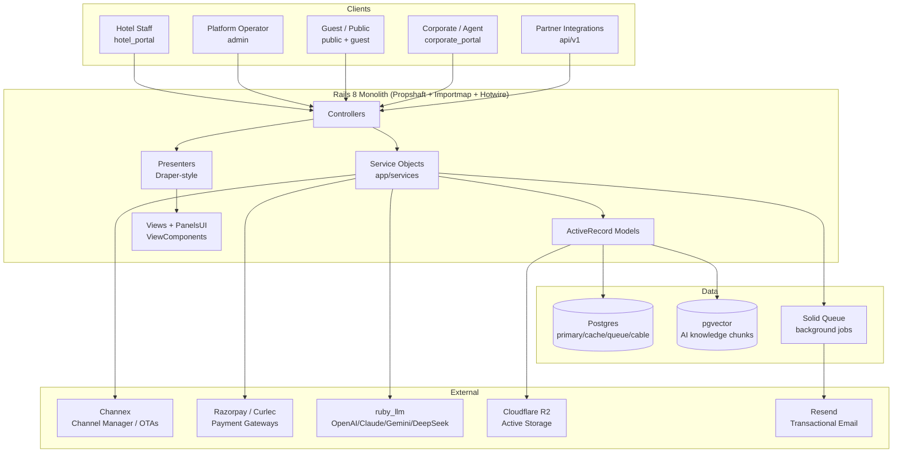
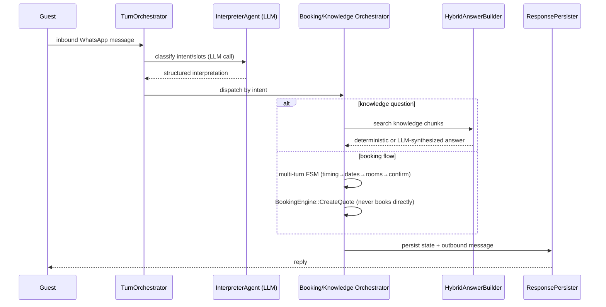

# Codebase Map

> Auto-generated by Cartographer. Last mapped: 2026-07-20T01:55:08Z

wastays is a hotel-management SaaS platform: a Rails 8 monolith serving five distinct audiences from one codebase — hotel staff, the platform operator (superadmin), prospective/staying guests, corporate/travel-agent billing clients, and third-party integrations (WhatsApp bots, channel managers).

## System Overview



## Stack

- **Framework**: Rails 8.0, Postgres (multi-database: `primary`, `cache`, `queue`, `cable` — Rails 8's "Solid Trifecta", no Redis), `pgvector`/`neighbor` for embeddings.
- **Frontend**: Propshaft (no Sprockets) + `importmap-rails` (no Node/esbuild/webpack toolchain) + Turbo + Stimulus (Hotwire) + Tailwind CSS v4 (`tailwindcss-rails` gem) + `view_component` (the in-house **PanelsUI** design system).
- **Background jobs / cache / realtime**: Solid Queue, Solid Cache, Solid Cable — all Postgres-backed, no Redis anywhere.
- **AI**: `ruby_llm` gem, provider-configurable per hotel (OpenAI, Anthropic/Claude, Gemini, DeepSeek) — powers the AI Concierge and an internal AI log analyzer.
- **Payments**: Razorpay (primary) / Curlec, adapter pattern (`Payments::GatewayAdapters::*`).
- **Channel manager**: Channex (OTA distribution — Booking.com, Agoda, etc.), adapter pattern (`ChannelManagers::ChannexAdapter`).
- **Storage**: Cloudflare R2 (S3-compatible, custom `ActiveStorage::Service::R2Service`), dynamically configured via a DB-backed `AppConfig` store rather than static credentials.
- **Email**: Resend via SMTP; `letter_opener_web` in dev.
- **Deployment**: Docker + Kamal, deployed via Coolify (three separate resources: web/worker/db); Thruster in front of Puma.
- **Testing**: RSpec + FactoryBot + Shoulda Matchers + Capybara/Cuprite (headless Chrome) + `parallel_tests` + Bullet (N+1 detection, opt-in via `BULLET=true`) + SimpleCov.
- **Security/quality gates** (`bin/ci`): RuboCop, Brakeman, bundle-audit, importmap audit, full parallel RSpec run.

Notably absent: no Sidekiq/Redis, no Node/Webpacker/esbuild, no Devise (custom session-based auth per portal), no component-preview tooling (Lookbook) — the `/system-design` route serves that role instead.

## Directory Structure

```
app/
  controllers/
    hotel_portal/       # hotel-staff dashboard — largest namespace (~98 files)
    admin/               # superadmin back-office
    public/              # anonymous guest site + auth + webhooks
    guest/                # logged-in guest self-service
    corporate_portal/    # corporate/agent AR portal
    api/v1/               # partner/WhatsApp integration API
    concerns/             # Breadcrumbable, Toastable, PlanGated, OffcanvasTransactionCompletion, ...
  services/               # the dominant business-logic layer, namespaced by domain
    hotel_portal/ ai_concierge/ folios/ bookings/ reports/ night_audits/
    channel_managers/ channex/ payments/ corporate_ar_payments/ booking_engine/
    hotel_ops/ folio_routing/ rooms/ housekeeping/ guest_arrival/ ... (40+ namespaces)
  models/                 # ActiveRecord — two aggregate roots: Hotel and Booking
  presenters/             # Draper-style, hotel_portal/ + corporate_portal/ + public/
  components/panels_ui/   # ViewComponent design system (~85 components)
  javascript/controllers/ # Stimulus, lazy-loaded via importmap (~168 files)
  assets/tailwind/        # ~50 CSS partials, 1:1 with panels_ui components
  views/                  # organized by portal namespace, mirrors controllers/
config/                   # routes, environments, initializers, importmap, recurring jobs
db/                       # schema.rb, migrate/, seeds
lib/tasks/                # rake tasks (channex sync, demo data, backfills, pruning)
docs/                     # per-feature living architecture docs (AI-agent workflow)
markdowns/                # standalone spec/roadmap documents
spec/                     # RSpec — models/services/requests/system/components (~900 files)
```

## Module Guide

### Domain Models & Database (`app/models`, `db/schema.rb`)

**Two-tier tenancy**: `Account` (`account_kind`: `hotel` or `corporate`) owns `Hotel`s directly; corporate `Account`s instead attach to hotels via the `hotel_corporate_accounts` join table (many-to-many), enforced by both a Postgres check constraint and a model validation. Almost every operational table is scoped by `hotel_id`, not `account_id`.

**Two aggregate roots**: `Hotel` (property config, 30+ associations) and `Booking` (reservation lifecycle). `Booking` includes `Bookings::StatusLifecycle` (`app/models/concerns/bookings/status_lifecycle.rb`) — a finite state machine (`pending → confirmed → checked_in → completed`, plus `no_show`/`cancelled` branches) enforced via `validate :status_transition_must_be_allowed`.

**Financial domain** (heaviest subsystem): `BookingFolio` → `FolioTransaction` (charges/payments/adjustments) → `TransactionCode`/`HotelTax` (chart-of-accounts + tax rules) → `ArInvoice`/`ArPayment`/`ArPaymentAllocation` (corporate accounts-receivable). **Immutability-by-convention**: `ArPayment`, `ArPaymentAllocation`, `FinancialAuditEvent`, `BookingAuditLog`, `FolioOperationLog` all override `before_update`/`before_destroy` to `throw :abort` — corrections happen via new reversal/allocation records, never mutation.

**Snapshot-at-booking-time**: `BookingGuest`, `BookingRoom`, `BookingQuoteItem` denormalize `*_snapshot` jsonb columns so historical bookings stay stable even if room types/rates/guest profiles change later.

**AI Concierge data**: `Prospect`/`ProspectMessage`/`ProspectConversationState` (optimistic-locked chat state) + `HotelKnowledgeDocument`/`HotelKnowledgeChunk` (pgvector `ivfflat` cosine index, 1536-dim embeddings) + `HotelKnowledgeDiagnostic` (logs unanswered questions for review).

**Notable schema patterns**: heavy use of Postgres check constraints and **partial unique indexes** to enforce "at most one active X" business rules directly in the database (one primary folio per booking, one current business date per hotel, one active global/hotel margin-rule default, etc.) — defense-in-depth beyond ActiveRecord validations. `folio_transactions` has 5 self-referential FKs (`reversal_of`, `voided_by`, `parent`, `split_from`, `moved_from`) modeling a full correction-lineage graph. Encryption (`encrypts`, several `deterministic: true`) is used for PII and secrets but is invisible at the schema level — visible only in the model layer.

### Controllers (`app/controllers`)

- **`hotel_portal/`** (largest namespace) — the staff dashboard: bookings (list, timeline board, ~20 transaction-offcanvas sub-controllers), the modern `BookingControlPanel*` workspace (folios, billing routes, guest management — actively replacing the legacy `BookingsController`/`FoliosController`, both marked `# LEGACY: frozen`), reports (~15 report types, consistently thin — logic lives in `Reports::*` services), inventory/rates/channel management, night audits, AR, knowledge base (AI concierge content), settings.
- **`admin/`** — superadmin back-office: hotel onboarding/lifecycle, payouts/reconciliations, margin/setup-fee rules, integrations (Channex/R2/AI provider keys), Observation Deck (in-house APM with AI-assisted log analysis).
- **`public/`** — anonymous booking funnel, login/registration, webhooks (payment gateway + Channex), and the "Digital Concierge" mobile mini-app (check-in/out/requests/contact via QR).
- **`guest/`** — logged-in guest self-service (distinct `Guest` identity model, not `User`); booking history, refund requests.
- **`corporate_portal/`** — B2B AR self-service (invoices, statements, payments via gateway or bank-transfer submission).
- **`api/v1/`** — bearer-token/API-key partner API, mixed with unauthenticated confirmation-token-based webhook endpoints in the same namespace (intentional but easy to mistake for a bug).
- **Shared concerns**: `Breadcrumbable`, `Toastable` (flash→Turbo Stream toast bridge), `PlanGated` (feature-flag gating), `OffcanvasTransactionCompletion` (the dominant "complete a Turbo-Stream drawer" response pattern), `GroupLifecycleTargeting` (apply a lifecycle transition across a whole group booking).
- Authorization is mostly hand-rolled (`current_user.has_permission?(slug, hotel:)`) rather than Pundit policies, though Pundit is used in a handful of spots.

### Services (`app/services`)

The dominant business-logic layer — controllers and models delegate almost everything here. **No shared base class or consistent Result-object convention** across the ~1,600 files (OpenStructs, custom Structs, and plain hashes all coexist) — a real inconsistency worth normalizing before it grows further, except in AI Concierge (`Orchestration::Core::Result` is a consistent value object there) and Folios/Bookings (implicit `.success?`/`.error` convention).

- **Folios** — a folio (`BookingFolio`) is a sub-ledger on a booking; `FolioTransaction` rows are the immutable ledger entries. Routing (`Folios::ResolveTargetFolio`) decides which folio a charge lands on based on staff override → `FolioRoutingRule` → booking's primary folio. Forecasted charges (`FolioForecastedCharge`) are "actualized" into real transactions at night audit, matched by deterministic idempotency keys (`Folios::ChargePostingKeys`) to prevent double-posting. Moves/splits work by reversing + reposting, never mutating in place.
- **Night Audit** (`NightAudits::Run`) — the daily close process: claims the business date, runs no-show/due-out sweeps, evaluates blockers (missing folios, unsynced payments, outstanding balances) in a `:pre_close` phase that halts before posting if anything's wrong, posts nightly charges, re-evaluates, then rolls the business date forward and creates a GL journal batch. Guarded everywhere by `NightAudits::OperationalChangeGuard` to prevent races with in-progress bookings changes.
- **Bookings lifecycle** — creation (`CreateManualBooking`/`CreateStaffBooking`) → pricing snapshot (`BuildFinancialSnapshot`) → room assignment/inventory deduction → status transitions (`Bookings::TransitionStatus`, the largest single service file) for check-in/check-out/cancel/no-show/reinstate, each following release-inventory → recompute-snapshot → deduct-inventory → resync-forecasts.
- **AI Concierge** (`app/services/ai_concierge`) — hybrid architecture: an LLM (`InterpreterAgent`) does structured interpretation only (intent/slots), while all state transitions and tool execution are deterministic Ruby (`TurnOrchestrator`, `Orchestration::Conversation::*`). Knowledge answers use a hybrid RAG pattern (`Tools::HotelInformation::HybridAnswerBuilder`): single close match → deterministic answer, multiple matches → LLM-synthesized. Booking flow never creates a real booking from chat — always terminates in a quote link, keeping payment out of chat.
- **Channel Manager integration** (`channel_managers/`, `channex/`) — adapter pattern (`ChannelManagers::BaseAdapter` → `ChannexAdapter`) so other channel managers could be swapped in. ARI pushes are buffered/debounced (`BufferAriSyncJob` → `FlushAriSyncJob`, 30s window) to avoid excessive external API calls from high-frequency rate/inventory edits. Per-person/age-banded rate plans are explicitly excluded from sync (Channex doesn't support them).
- **Payments** (`payments/`, `corporate_ar_payments/`) — gateway adapter pattern (Razorpay/Curlec), HMAC-verified webhooks, idempotent transaction recording with race-safe `RecordNotUnique` handling.
- **Financial Controls** (`financial_controls/`) — `PostingGuard.call!` is the universal gate almost every money-moving service calls before writing a ledger entry; enforces business-date locking and override-reason/permission requirements.

### Presenters (`app/presenters`)

Draper-style decorators/POROs shaping data for views. Notable duplication: `hotel_portal/accounts_receivable/*` and `corporate_portal/accounts_receivable/*` are near-mirror-image presenter trees (same class names, same struct shapes) — one from the hotel's perspective, one from the corporate client's — likely intentional for authorization-boundary clarity but a candidate for a shared base if that changes. Money formatting (`"#{currency} #{format('%.2f', amount)}"`) is duplicated per-presenter rather than centralized, though a real `CurrencyFormatter` service exists and is used in the `Public::*` namespace.

### Views (`app/views`)

Organized to mirror the controller namespaces. Recurring conventions across nearly every list page: a desktop `<table>` and a separate mobile card list are both rendered server-side and toggled by CSS breakpoint (not conditional rendering) — consistent but duplicative. Turbo Frames dominate over Turbo Streams; the **offcanvas-drawer pattern** (`turbo_frame_tag "offcanvas_drawer"`) is a singleton frame reused across dozens of different staff actions (one frame slot, many possible contents).

Highest-complexity views: the booking timeline board (`hotel_portal/bookings/board`, drag-and-drop pixel-positioned Gantt-style grid), the room status board (similar CSS-grid + absolute-positioned overlay pattern), the inventory/rates dashboard (`inventory_dashboards/_index_content.html.erb`, 673 lines), and the night-audit blocker-resolution wizard (fully client-rendered via Stimulus).

Flagged fat-view / logic-in-template issues worth cleaning up opportunistically: `bookings/transactions/check_out/partials/_settlement_details.html.erb` calls domain services (`ArInvoices::CreditExposure`, `Bookings::RepairNoShowTourismTax`) directly; `inventory_dashboards/_index_content.html.erb` computes occupancy-threshold coloring inline in several places instead of a shared helper; `folios/show/_folio_balance_summary.html.erb` computes outstanding-balance math directly from raw models; `admin/plans/index.html.erb` hardcodes feature-slug business rules in the template. Several scaffold-stub views are dead code left over from generators (`margin_rules/create.html.erb`, `general_ledger_maps/update.html.erb`, `room_types/create.html.erb`, etc.) — safe cleanup candidates.

### JS / Stimulus (`app/javascript/controllers`)

Registered via `importmap-rails` + `@hotwired/stimulus-loading`'s `lazyLoadControllersFrom` — each of the ~168 controller files is fetched on first use of its `data-controller` value, not bundled. This is why pages that reference many distinct controllers at once (notably `/system-design`, which shows all ~39 PanelsUI component previews) trigger dozens of individual asset requests.

Two parallel design-system generations coexist: an older set of ad-hoc dialog/dropdown/select controllers at the root of `controllers/`, and a newer, more disciplined `panels_ui/` layer built consistently on `@floating-ui/dom`. Both are still actively used in different views.

Notable complex controllers: `inventory_calendar_controller.js` (1228 lines, the largest file — full bulk ARI editor with localStorage-staged pending edits). **Confirmed bug**: it defines `disconnect()` twice (lines 122 and 179); JS silently keeps only the second, so the `turbo:frame-load` and tooltip-close listeners registered in the first are never cleaned up — a real listener-leak worth fixing. Also notable: `blocker_wizard_controller.js` (464 lines, hand-built HTML-string templating for the night-audit wizard, polls every 5s), `booking_calc_controller.js` (426 lines, live price calculation, logic partially duplicated with `booking_room_rows_controller.js`).

Only real npm dependencies (via importmap CDN pins): `@floating-ui/dom`, `tom-select`, `cally` (date picker), `signature_pad`, `focus-trap`, `body-scroll-lock`, `apexcharts`. No SortableJS — drag-and-drop (timeline board, requests board) is hand-rolled on native HTML5 DnD.

### PanelsUI Design System (`app/components/panels_ui`, `app/assets/tailwind`)

ViewComponent-based, ~85 components, each with a **1:1 matching Tailwind CSS partial** (`app/assets/tailwind/panel/<component>.css`) — the clearest organizing principle of the styling layer. Two coexisting variant-composition patterns: a `cva`-style Ruby DSL (`PanelsUI::BaseComponent#style`/`class_for`, used by ~7 components) and `data-*` attribute dispatch targeted by CSS attribute selectors (used by the rest) — likely chosen per-component based on how complex the CSS needs to be.

**oklch vs oklab is intentional, not a bug**: design tokens are authored in `oklch()` (perceptually-tunable L/C/H axes) in `panel/theme.css`/`public/theme.css`; component CSS uses `color-mix(in oklab, ...)` for hover/active-state derivation (oklab is the recommended interpolation space for `color-mix()`, avoiding hue-fringing artifacts). Dark mode is attribute-based (`[data-theme="panel-light"]` vs `[data-theme="panel"]`), not Tailwind's `dark:` variant.

The `/system-design` route is this app's Storybook-equivalent — one partial per component, added by appending one array entry + one partial file.

### Infra / Config

- **Routing** (`config/routes.rb`) — heavy use of `scope "/hotel/:hotel_id"` and custom member/collection actions rather than pure REST, reflecting the workflow-heavy PMS domain (check-in, check-out, no-show, cancel, move, etc. are all first-class routes, not just `update`).
- **Background jobs** (`config/recurring.yml`, Solid Queue) — `release_expired_holds` (1 min), `pull_channex_revisions` (15 min), `run_scheduled_night_audits` (15 min), `cleanup_room_locks` (5 min), `financial_observability` (hourly), `prune_observation_entries` (daily).
- **Deployment** — Docker + Kamal (`config/deploy.yml`) with `CONTAINER_ROLE` env switching web vs. worker CMD; actual production deploy is via three separate Coolify-managed resources (web/worker/db).
- **CI** (`bin/ci`, local only) — RuboCop → Brakeman → bundle-audit → importmap audit → Tailwind build → parallel RSpec across the *entire* suite, including `spec/system` (worker count auto-capped by both CPU and memory to avoid saturating headless-Chrome-heavy system specs). `bin/test` supports 14 named test domains for targeted runs, including a `fast` domain (everything except `spec/system`) and a `system` domain.
- **GitHub Actions** (`.github/workflows/ci.yml`) — mirrors `bin/ci`'s lint/security jobs (RuboCop, Brakeman, bundle-audit, importmap audit) plus a `test` job, but the `test` job intentionally runs only the `fast` (non-browser) spec directories — `spec/system` is excluded from CI and is a local-only responsibility (`bin/test system` or full `bin/ci`) to avoid browser-test flakiness/slowness gating merges.
- **Rake tasks** (`lib/tasks`) — Channex manual sync triggers, demo data/hotel generation, folio backfills, observation-entry pruning, WCAG contrast auditing (`tokens:contrast`, using `lib/color_contrast.rb`).

### Existing Documentation (`docs/`, `markdowns/`)

`docs/` follows a repeatable per-feature structure (`knowledges/` → `changelog.md` → `completed-roadmap/` → `upcoming-roadmap/` → `test-cases/` → `pr_message/`) that reveals an **AI-agent-driven, spec-first development workflow** — each changelog entry names the exact RSpec/RuboCop commands run as verification evidence. Read a feature's `knowledges/` first for current architecture truth before making changes to `ai_concierge`, `night-audits`, `folio-transactions`, or `hotel-bookings`.

`markdowns/` holds standalone specification documents: `TECHNICAL_SPECIFICATION.md` and `FRONTEND_SPECIFICATION.md` are the original MVP architecture/UX specs (still broadly accurate to the current structure), `CHANNEX_API.md`/`CHANNEX_INTEGRATION_PLAN.md` describe the channel-manager integration design, and several others (`ACTION_PROXY_SPEC.md`, `PER_PAX_BOOKING_AND_ALLOCATION_PLAN.md`) represent earlier design iterations later superseded by what's actually implemented (e.g. `AgentAccount` was merged into `HotelCorporateAccount` — see `docs/agent-account-unification.md`).

## Data Flow

### Booking creation → folio → night audit

```mermaid
sequenceDiagram
    participant Staff as Hotel Staff
    participant Ctrl as Bookings::Transactions Controller
    participant Create as Bookings::CreateStaffBooking
    participant Snap as BuildFinancialSnapshot
    participant Folio as Folios::InitializeForBooking
    participant Audit as NightAudits::Run

    Staff->>Ctrl: submit new booking form
    Ctrl->>Create: create booking
    Create->>Snap: compute rate + tax snapshot
    Create->>Create: assign room, deduct inventory
    Create->>Folio: initialize primary folio
    Folio-->>Create: folio ready
    Create-->>Ctrl: booking confirmed

    Note over Audit: once per hotel per business date
    Audit->>Audit: evaluate blockers (pre_close)
    Audit->>Audit: Folios::PostNightlyCharges (actualize forecasts)
    Audit->>Audit: evaluate blockers (post_close)
    Audit->>Audit: BusinessDates::CloseAndOpenNext
```

### AI Concierge turn pipeline



## Conventions

- **Service-object delegation** — controllers and models both push business logic into `app/services/**`, kept thin themselves.
- **Money as `BigDecimal`** throughout, never Float.
- **Idempotency keys** on retryable/replay-sensitive operations (`BillingRouteBatch`, `GroupBillingChangeBatch`, `NotificationDelivery`, `Folios::ChargePostingKeys`).
- **`FinancialControls::PostingGuard`** as the universal ledger-locking gate — call it before any folio/GL mutation.
- **ViewComponent + Stimulus + Tailwind CSS partial**, 1:1 paired, for any new PanelsUI primitive.
- **Presenter pattern** for view-specific formatting — keep logic out of ERB (existing violations are flagged above, not a green light to add more).
- **`data-controller="auto-submit"`** is the standard pattern for live-filtering index pages via Turbo Frame + `turbo_action: "advance"`.

## Gotchas

- Service Result-object shape is inconsistent across the codebase (OpenStruct vs. custom Struct vs. plain hash) — check the specific service before assuming `.success?`/`.error` works uniformly.
- `inventory_calendar_controller.js` has a real double-`disconnect()` bug (confirmed at lines 122 and 179) — the second definition silently wins, leaking the first's event listeners.
- Several views call domain services or compute money/business logic directly instead of going through a presenter (see Views section above) — don't copy this pattern in new code.
- `folios/transactions/_sheet.html.erb` and `folios/transactions/_modal.html.erb` are two near-duplicate implementations of the same post-transaction form — consolidate before adding a third.
- A handful of views are dead Rails-scaffold stubs (`*/update.html.erb`, `*/create.html.erb` in several settings/room_types/margin_rules controllers) — safe to delete once confirmed unreferenced.
- `hotel_portal` and `corporate_portal` AR presenter trees are near-duplicates — changes to one's business rules likely need mirroring in the other today.
- The `/system-design` showcase page's unbundled-JS asset flood (161 lazily-loaded Stimulus files) is a known source of Ferrum/Capybara flakiness in system specs; use the `visit_when_loaded` helper (`spec/support/system_auth_helper.rb`) rather than plain `visit` when a spec hits that route.

## Navigation Guide

**To add a hotel_portal feature**: routes (`config/routes.rb`, scoped under `/hotel/:hotel_id`) → controller (add a concern if the before_action/response pattern is shared) → service object in the matching `app/services/<domain>` namespace → presenter if the view needs formatted data → view partial + Stimulus controller if interactive.

**To add a PanelsUI component**: component class in `app/components/panels_ui/` (decide `cva`-style vs. `data-attribute` variants based on CSS complexity) → matching Tailwind partial in `app/assets/tailwind/panel/` → preview partial + one line in `app/views/system_designs/index.html.erb` → Stimulus controller in `app/javascript/controllers/panels_ui/` if interactive.

**To touch anything financial (folios, night audit, AR)**: read `docs/night-audits/knowledges/` and `docs/folio-transactions/knowledges/` first, then check `FinancialControls::PostingGuard` and `NightAudits::OperationalChangeGuard` — most financial services need to go through one or both.

**To touch the AI Concierge**: read `docs/ai_concierge/knowledges/01-architecture-overview.md` first — the core principle is "the interpreter is never trusted for final state changes without Ruby guards."

**To debug a Channex sync issue**: start at `app/services/channel_managers/channex_adapter.rb`, check for `"pending"`-prefixed `ChannelMapping#external_id` values (means the entity was never successfully synced), and check `lib/tasks/channex.rake` for manual re-trigger tasks.
